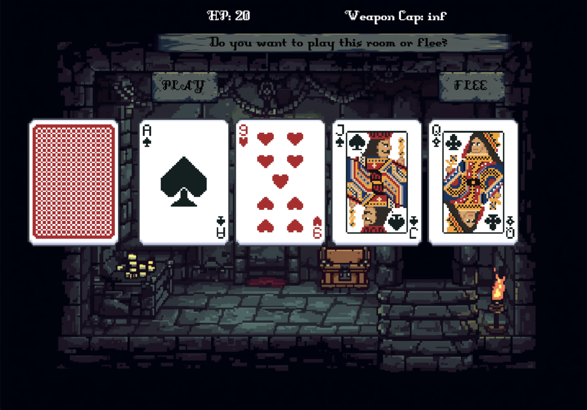

# Scoundrel




This is a pygame implementation of the card game Scoundrel. Click on cards to play them, fight monsters, collect weapons and potions, and try to clear the dungeon.

## How to play

You move through a dungeon one room at a time. Each room contains 4 cards drawn from a modified deck — a standard 52-card deck with the red face cards (J, Q, K, A of ♥ and ♦) removed, leaving 44 cards. At the start of each room, you can choose to **flee or play** the room. If you flee, the remaining cards get added to the bottom of the deck — you cannot flee two consecutive rooms.

If you stay, choose a card to play. Once you have played 3 of the 4 cards, you move to the next room — the 1 remaining card carries over and the 3 empty slots are refilled from the deck. Each suit has a different effect:

- **♣ / ♠ (black)** — Monsters. They deal damage equal to their rank value (J=11, Q=12, K=13, A=14). If you have a weapon, you can use it to block some of the damage.
- **♥ (red)** — Potions. Heal equal to the card's rank value, up to a max of 20 HP.
- **♦ (red)** — Weapons. Equip the card as your weapon. You can only carry one weapon at a time — equipping a new one loses the old. When facing a monster, you can choose to use your weapon or fight barehanded. Using the weapon reduces the monster's damage by the weapon's rank value. However, the weapon then gets capped and can only be used against monsters of lower rank than the last one you blocked.

You start with 20 HP. The game ends when there are not enough cards left in the deck to refill the room (you win) or your HP hits 0 (you lose).

## Requirements

- Python 3.11
- pygame (`pip install pygame`)

## Running the game

```
source venv/bin/activate
python main.py
```

<!-- 
DISTRIBUTION PLAN:
- Use PyInstaller to build executables: `pyinstaller --onefile --windowed main.py`
- Mac (.app) and Windows (.exe) must be built separately on each platform
- Use GitHub Actions with windows-latest and macos-latest runners to build both automatically on push
- Attach executables as release assets on GitHub for direct download
- Consider making repo private before selling on itch.io

ASSET LICENSES — CHECK BEFORE SELLING COMMERCIALLY:
- Card images (assets/cards/): https://kerenel.itch.io/pixelart-cards — CC0, commercial use allowed
- Font (DungeonFont): https://vrtxrry.itch.io/dungeonfont — CC0, commercial use allowed
- Stone texture (assets/stone.png): AI generated via Canva — commercial use allowed per Canva AI Product Terms (March 2026). Old version kept as `assets/stone_old.png` (from https://crusenho.itch.io/complete-ui-essential-pack, CC BY 4.0) in case of revert.
- Background, win/lose screens: AI generated via Canva — commercial use allowed per Canva AI Product Terms (March 2026)
- Screenshot: own work, no issues
-->

## Development notes

- Game phases (flee_or_play, playing, etc.) currently have two separate code blocks each — one for rendering, one for event handling. Consider refactoring into a state machine with proper state objects (render + handle input in one place per state) as complexity grows.
